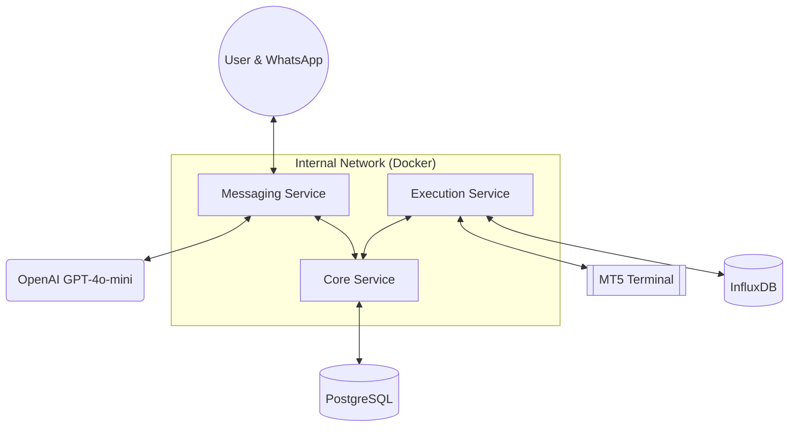

# MT5 Quant Server (Microservices)

[](https://github.com/USER/mt5-quant-server/actions/workflows/deploy.yml)

A professional, industrial-grade microservices ecosystem designed for real-time algorithmic trading and portfolio management via WhatsApp. It bridges the gap between a **MetaTrader 5 (MT5)** terminal and the **WhatsApp Cloud API**, utilizing **OpenAI** for high-performance natural language execution.

---

## Architecture at a Glance

The system is built on a modular, containerized architecture that ensures high availability, strict resource isolation, and easy scalability.



---

## Documentation Index

Explore the detailed architecture and implementation details:

1.  **[System Architecture](docs/architecture.md)**: High-level design, data flows, and service interactions.
2.  **[Microservices Deep Dive](docs/services.md)**: Individual service roles, port assignments, and API endpoints.
3.  **[Infrastructure & Dev-Ops](docs/infrastructure.md)**: Docker orchestration, Terraform IaC, and GitHub Actions CI/CD.
4.  **[CI/CD & Automation](docs/cicd.md)**: Quality Assurance pipelines, testing strategies, and manual validation.
5.  **[Data Layer](docs/database.md)**: PostgreSQL schemas, InfluxDB usage, and Alembic migrations.
6.  **[Local Development](docs/development.md)**: Step-by-step setup, running tests, and `uv` workspace commands.
7.  **[Hybrid Cloud Setup](docs/hybrid_setup.md)**: Guide for connecting your GCP VM to Local Databases.
8.  **[GCP & GitHub Secrets Setup](docs/secrets_setup.md)**: Guide for authorizing automated deployments.

---

## Quick Start (Docker)

To launch the full stack locally with a dedicated PostgreSQL database:

1.  **Duplicate the environment examples**:
    ```bash
    cp .env.example .env
    cp infra/envs/shared.env.example infra/envs/shared.env
    # ... fill in your credentials in these files
    ```

2.  **Start the containers**:
    ```bash
    docker compose -f infra/compose/docker-compose.yml up --build
    ```

---

## Structure
- `services/`: Functional microservices (FastAPI).
- `libs/`: Shared workspace packages.
- `infra/`: Docker, Terraform, and environment orchestration.
- `docs/`: In-depth documentation suite.
- `scripts/`: Operational and database management utilities.
- `templates/` & `static/`: Frontend assets for core service dashboards.
