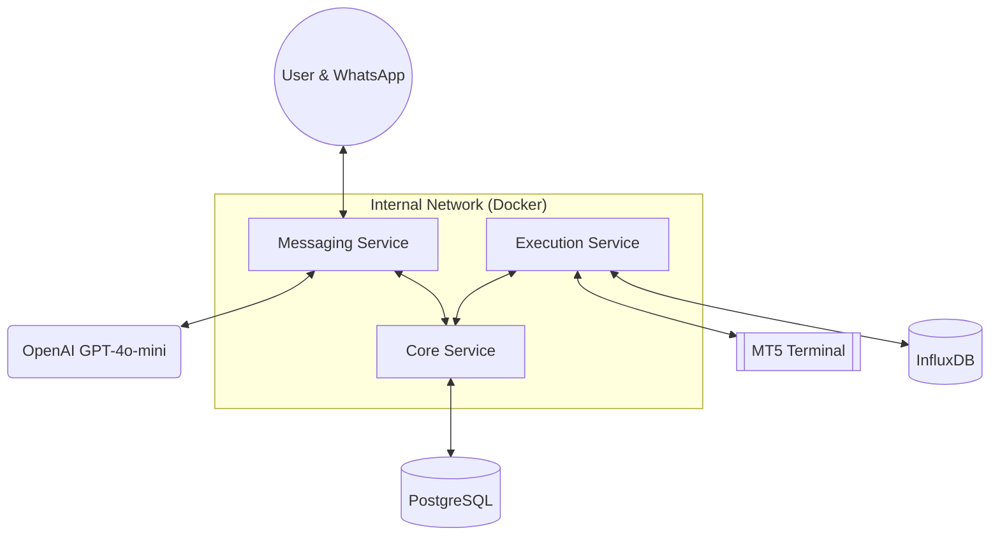

# System Architecture

This project is a distributed microservices ecosystem designed for real-time algorithmic trading and portfolio management via WhatsApp.

## High-Level Overview

The system bridges the gap between a **MetaTrader 5 (MT5)** terminal and the **WhatsApp Cloud API**, utilizing **OpenAI** for natural language understanding and **PostgreSQL/InfluxDB** for state and performance management.

## Core Components

### 1. Messaging Service (`messaging-service`)
- **Role**: The gateway between the user and the system.
- **Functions**: Handles WhatsApp webhooks, performs authentication, and hosts the AI Agent.
- **AI Agent**: A LangChain/LangGraph-powered React agent that uses OpenAI to translate user requests (e.g., "Compra 0.1 lotes de EURUSD") into service calls.

### 2. Core Service (`core-service`)
- **Role**: The source of truth for user state and portfolio.
- **Functions**: Manages User profiles, Watchlists, Price Alerts, and the synchronized state of Open Positions.
- **Persistence**: PostgreSQL (via SQLAlchemy).

### 3. Execution Service (`execution-service`)
- **Role**: The bridge to the financial markets.
- **Functions**: 
    - Polls the MT5 terminal for real-time position updates.
    - Receives trade signals (BUY/SELL/CLOSE) and queues them for MT5 execution.
    - Synchronizes MT5 terminal data with the Core Service.
- **Persistence**: InfluxDB for high-frequency trade logging.

## Data Flow Patterns

### Signal Processing (MT5 -> DB)
1. **Execution Service** polls MT5 every $N$ seconds.
2. It detects position changes (e.g., a take-profit hit).
3. It pushes the updated state to the **Core Service**.
4. It logs the event to **InfluxDB** for performance analytics.

### Trade Execution (User -> MT5)
1. **User** sends a message to WhatsApp.
2. **Messaging Service** parses the intent via OpenAI.
3. It calls the **Execution Service** `/signal` or `/close_position` endpoint.
4. **Execution Service** validates limits (position gating) and appends the command to the MT5 queue.
5. MT5 terminal picks up the command and executes.

## Network & Security
- **Internal Communication**: Services communicate via private hostnames (e.g., `http://core_service:8001`) within a Docker bridge network.
- **External Security**: 
    - Traffic to the services is restricted via GCP Firewall rules to specific IPs (User and Meta).
    - Sensitive tokens are managed via **GCP Secret Manager**.
